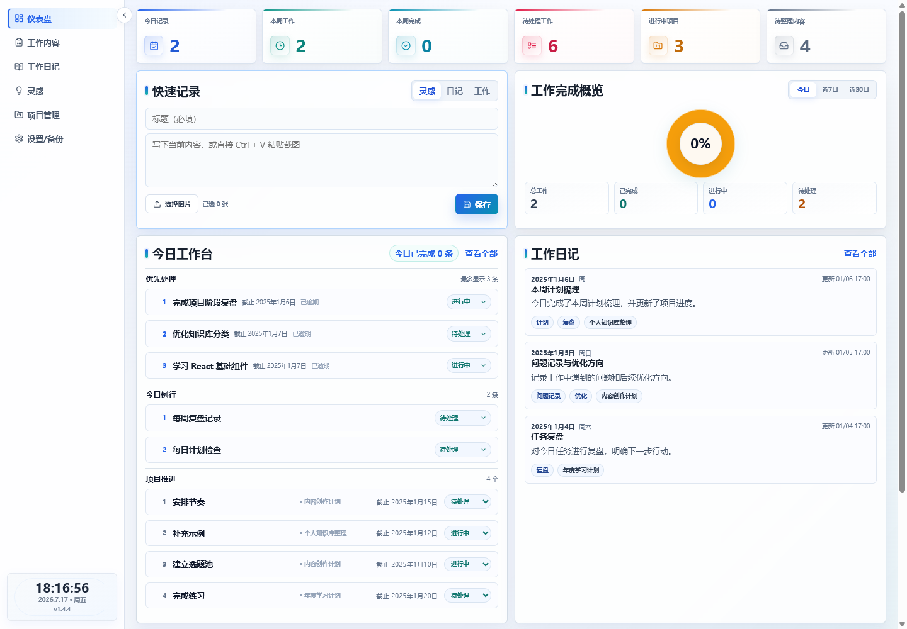
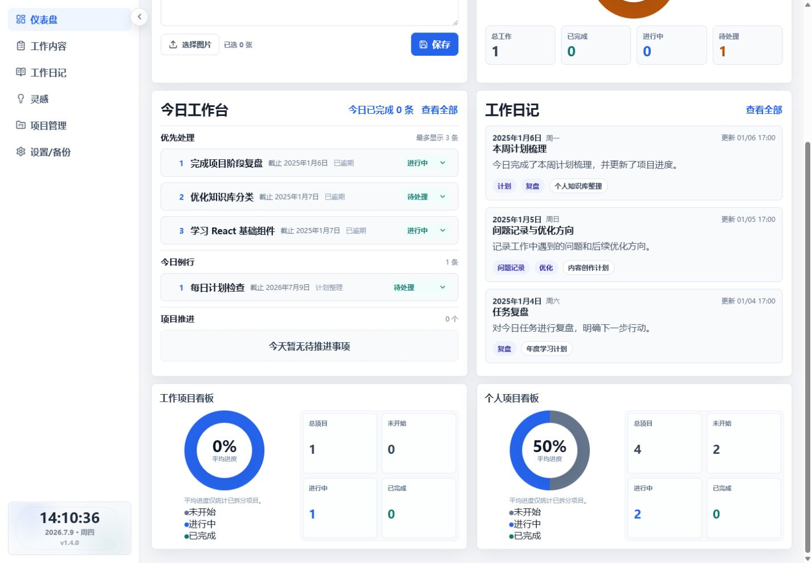
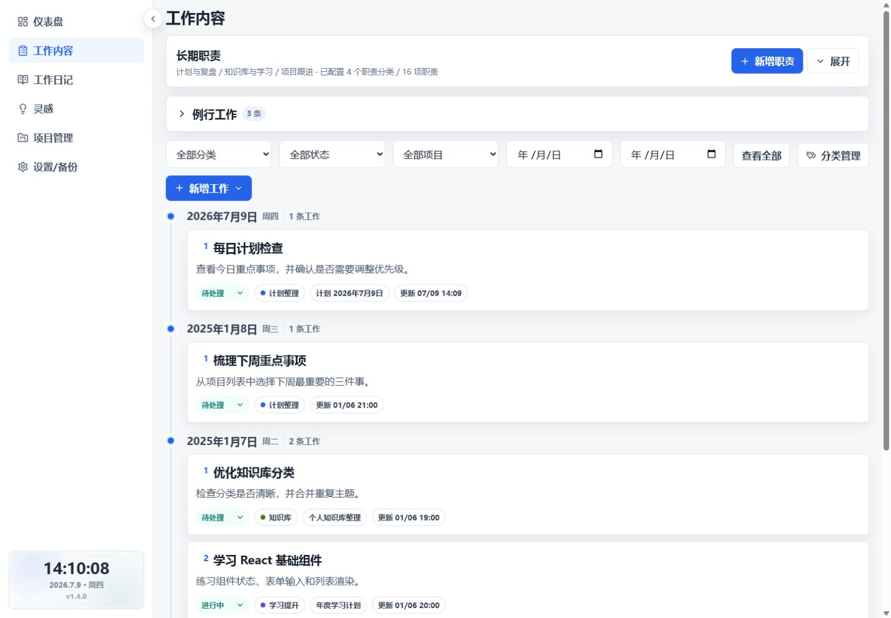
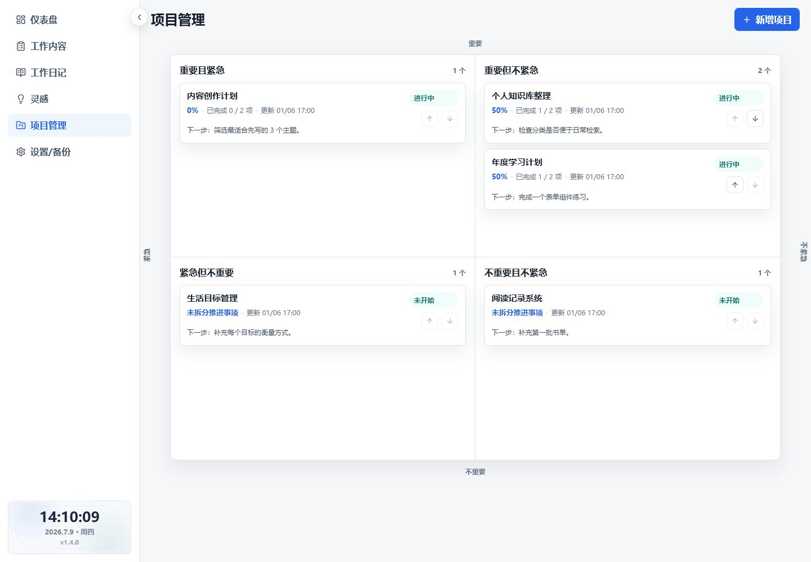
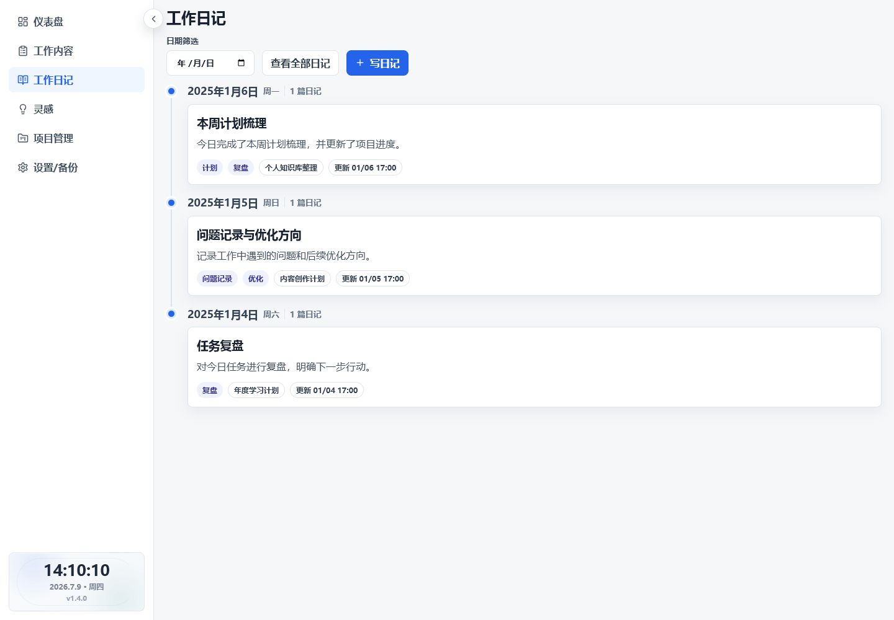
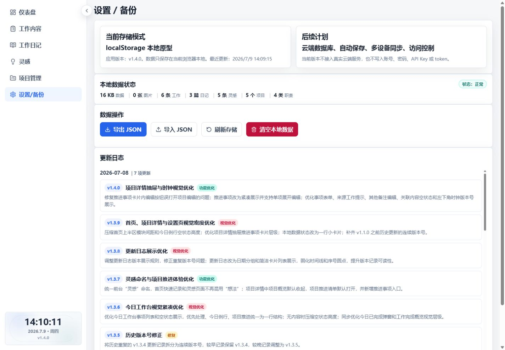

# 个人工作仪表板模板

一个面向个人工作的本地优先管理仪表板：默认无需后端和数据库，下载后即可运行，也可以通过 GitHub Template 创建自己的版本并继续二次开发。

这是一个基于 React、TypeScript 和 Vite 的开源模板项目。项目默认使用浏览器本地存储；配置 Supabase 环境变量后可启用邮箱登录与受控云端保存。仓库只包含通用中文演示数据，不包含个人工作数据、账号、联系方式、密钥、token、本地私人路径或内部业务信息。

当前版本：**v1.5.0** · [查看更新日志](CHANGELOG.md)

## v1.5.0

- 登录状态下，侧栏底部新增账号首字与账号名称展示；长名称自动省略，折叠侧栏仅保留头像首字，原退出登录入口保持不变。
- “优先处理 / 今日例行 / 项目推进”统一使用轻量单行空状态，移除今日例行的大面积虚线框，并压缩全空工作台高度。
- 首页工作日记改为展示最近 3 个自然日内的全部日记，按日期从新到旧排序；第 4 天及更早记录仍可通过“查看全部”访问。
- 本次不修改历史日记、核心业务逻辑、数据结构、localStorage key 或 SCHEMA_VERSION。

## 项目特点

- 数据默认保存在当前浏览器，未配置 Supabase 时不依赖服务器和数据库。
- 未配置 Supabase 时不启用账号体系，安装依赖后即可使用。
- 支持 JSON 导出、导入和旧版本备份兼容。
- 仓库只包含通用中文演示数据，不包含真实个人或业务信息。
- 同时适配电脑端和手机端。
- 基于 React、TypeScript 和 Vite，便于继续修改页面、数据与功能。

## 效果预览



## 页面截图

### 今日工作台

集中查看优先处理、今日例行、项目推进和状态操作。



### 工作内容

按分类、状态、项目和日期筛选工作，并直接管理事项状态。



### 项目管理

使用重要紧急四象限组织项目，并查看由推进事项自动计算的进度。



### 工作日记

按日期整理复盘记录、标签和关联项目；灵感页面可另外保存文字、截图和待整理内容。



### 设置与数据备份

查看本地数据状态，完成 JSON 导入导出、存储刷新和演示数据恢复。



## 核心功能

- **首页工作概览**：汇总今日记录、本周工作、本周完成、待处理工作、进行中项目和待整理内容。
- **今日工作台**：集中展示优先事项、今日例行、项目推进和今日已完成内容。
- **工作内容管理**：新增、筛选、查看和更新待处理、进行中、已完成、暂停等工作事项。
- **工作模板**：把高频但非固定周期的工作保存为模板，创建时先预填再由用户确认。
- **例行工作**：支持每天、工作日、每周、每月和自定义日期，以及暂停、恢复、跳过、顺延和节假日处理。
- **工作日记**：按日期记录总结、问题、复盘、标签和关联项目。
- **灵感记录**：快速保存文字、截图、图片和待整理内容，并可转为工作内容或工作日记。
- **项目管理**：按重要紧急四象限管理项目状态、背景、目标、风险和下一步动作。
- **项目推进清单**：将项目拆成可执行事项，推进事项和下一步动作都可先转入新增工作表单。
- **项目自动进度**：根据推进事项完成数量自动计算项目进度，无推进事项时明确提示。
- **分类管理**：自定义工作分类名称、颜色和排序。
- **长期职责**：按职责组维护长期负责范围，帮助区分固定职责、临时任务和项目任务。
- **数据备份与恢复**：支持导出 JSON、导入 JSON、刷新存储和恢复通用演示数据。
- **响应式布局**：支持电脑端和手机端使用。

## 适合哪些人

- 想把待办、项目、例行工作、日记和灵感放在一个工作台中的个人用户。
- 希望数据先保存在本机浏览器中的运营、产品、开发和自由职业者。
- 想直接使用开源模板，或在现有能力上继续二次开发的人。

## 快速开始

先安装 Node.js，然后运行：

```bash
npm install
npm run dev
```

终端会显示本地访问地址，通常为：

```text
http://localhost:5173/
```

## 构建和检查命令

```bash
npm run lint
npm run build
npm run test:project
npm run test:routine
npm run test:dashboard
npm run test:sync
```

构建产物生成在 `dist` 目录中。`dist` 已加入 `.gitignore`，不会提交到仓库。

## 数据存储与隐私说明

- 默认使用浏览器 `localStorage`。
- 未配置 Supabase 环境变量时不需要后端服务，也不启用账号体系。
- 配置 Supabase 后可启用邮箱登录；侧栏账号名称只读取当前运行时会话的已有 metadata 或邮箱，不新增账号存储字段。
- 自动云端保存默认关闭；未主动启用时，换浏览器、换设备或清空浏览器数据后，本地数据不会自动同步。
- 仓库仅包含虚构的通用演示数据，不包含个人工作记录、客户信息、联系方式、真实账号、密码、API Key、token、本地私人路径或内部业务名称。
- 重要数据建议在“设置 / 备份”页面定期导出 JSON 备份。

## 数据备份和兼容说明

- 建议定期在“设置 / 备份”页面导出 JSON。
- 导出的 JSON 包含 `version`、`appVersion` 和 `schemaVersion`。
- 旧版本 JSON 备份可以继续导入；缺少的新字段会在读取时补齐。
- 读取旧本地数据时会先保留迁移前备份，再完成字段兼容。
- 导入失败时不会覆盖当前数据。

## 部署方式

### Vercel

1. 将仓库导入 Vercel。
2. Framework Preset 选择 `Vite`。
3. Build Command 使用 `npm run build`。
4. Output Directory 使用 `dist`。
5. 保存并部署。

### Cloudflare Pages

1. 在 Cloudflare Dashboard 进入 `Workers & Pages` 并创建 Pages 项目。
2. 连接自己的 GitHub 仓库。
3. Framework preset 选择 `Vite`。
4. Build command 填写 `npm run build`。
5. Build output directory 填写 `dist`。
6. 保存并部署。

## 使用 GitHub Template 创建自己的版本

在 GitHub 仓库页面点击 `Use this template`，选择 `Create a new repository`，填写仓库名称后即可获得自己的副本。你可以继续替换演示数据、调整颜色、修改页面或增加自己的功能。

## 更新日志与版本规则

- 完整用户更新记录：[CHANGELOG.md](CHANGELOG.md)
- 版本规则与数据兼容边界：[docs/VERSIONING.md](docs/VERSIONING.md)

v1.5.0 在不改变历史数据、`localStorage` key 或 `SCHEMA_VERSION` 的前提下补齐登录账号展示，统一今日工作台轻量空状态，并把首页工作日记范围调整为最近 3 个自然日。

## 开源协议

本项目使用 [MIT License](LICENSE)。你可以自由使用、修改和分发，但请保留许可证说明。
